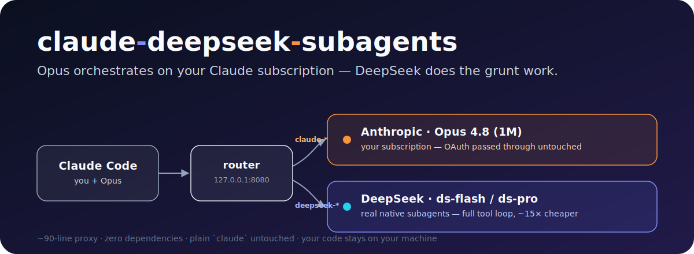
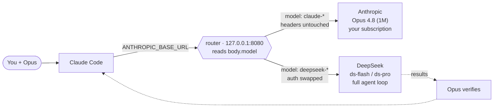

<p align="center">
  
</p>

<p align="center">
  <a href="LICENSE"></a>
  
  
  
  <a href="#contributing"></a>
</p>

<h1 align="center">claude-deepseek-subagents</h1>

<p align="center"><b>Keep Opus as your orchestrator on the plan you already pay for.<br>Let DeepSeek v4 do the grunt work as real, native subagents.</b></p>

---

> **You wouldn't put ten $300k senior engineers on grunt work.** You'd keep *one* sharp senior to plan and review, hand the legwork to cheap interns, and have the senior check it before it ships.
>
> **That's exactly this setup.** **Opus is your senior** — on the plan you already pay for — thinking, delegating, and reviewing. **DeepSeek v4 subagents are the interns**: fast, cheap, and doing the actual grinding under the senior's supervision. Senior judgment on intern-priced labor, in one Claude Code session.

Claude Code is brilliant — but every subagent it spawns (searching, reading dozens of files, mechanical edits, running tests) also burns **Opus** — like paying senior rates for intern work. On a Pro/Max plan you hit your weekly limit fast; on API billing you pay Opus prices for work a cheaper model does just as well.

This fixes that **without giving anything up**. A tiny proxy routes each request by its model id:

- your **main agent stays on Opus, on your subscription** — untouched, same login, same quota;
- **subagents run on DeepSeek** — as *real* Claude Code subagents with the full tool loop (read, grep, bash, edit), not a blind "ask an API" helper;
- Opus then **verifies** their work.

One session. One command to install. Nothing else in your setup changes.

## Why this instead of a "normal" setup?

There are a few obvious ways to bolt a cheaper model onto Claude Code. Each one gives something up — this doesn't:

| Approach | Main agent | Subagents | Keeps your subscription | Subagents have tools | Extra moving parts |
|---|:---:|:---:|:---:|:---:|:---:|
| **Plain Claude Code** | Opus | Opus 💸 | ✅ | ✅ | none |
| `ANTHROPIC_BASE_URL` → DeepSeek | DeepSeek ❌ | DeepSeek | ❌ (whole CLI leaves Claude) | ✅ | env only |
| Full gateway / router | Opus\* | any | ⚠️ usually drops to API billing | ✅ | a gateway for **all** traffic |
| MCP "ask DeepSeek" tool | Opus | — (a text call) | ✅ | ❌ blind, no files | an MCP server |
| **→ this project** | **Opus** | **DeepSeek** | **✅ untouched** | **✅ full loop** | **one ~90-line local proxy** |

The catch everyone runs into is that `ANTHROPIC_BASE_URL` is **global** — point it anywhere and your *main* agent leaves Anthropic too. The usual conclusion is "a proxy breaks your subscription."

**It doesn't have to.** This proxy only rewrites auth for `deepseek-*` requests. For `claude-*` requests it forwards Claude Code's own headers **untouched**, so your subscription OAuth token reaches Anthropic exactly as if the proxy weren't there. That one detail is what lets Opus and DeepSeek run side by side in the same session — Opus on your plan, DeepSeek on its cheap API.

## How it works



- The **proxy** (`proxy.mjs`, ~90 lines, zero deps) is the whole trick. It reads `body.model` and forwards to the right upstream, swapping the `Authorization` header only for DeepSeek.
- The **subagents** are ordinary named Claude Code agents (`~/.claude/agents/ds-flash.md`, `ds-pro.md`) whose `model:` frontmatter is a `deepseek-*` id. No plugin, no patch — the routing lives entirely in the proxy.
- The **launcher** `claude-ds` starts the proxy, pins the main model to Opus 1M, and injects a policy telling the orchestrator to delegate to DeepSeek by default and verify the results.

## Install

```bash
curl -fsSL https://raw.githubusercontent.com/CristhianKapelinski/claude-deepseek-subagents/main/install.sh | bash
```

<details>
<summary>or from a clone</summary>

```bash
git clone https://github.com/CristhianKapelinski/claude-deepseek-subagents
cd claude-deepseek-subagents
./install.sh
```
</details>

Then drop your DeepSeek key (from <https://platform.deepseek.com/>) into `~/.claude/deepseek/.env`:

```
DEEPSEEK_API_KEY=sk-...
```

**Requirements:** `node` 18+, `curl`, and a `claude` (Claude Code) logged into your subscription.

## Use

```bash
claude-ds        # instead of `claude`
```

You get Claude Code exactly as usual — except when the orchestrator delegates, the work runs on DeepSeek. Plain `claude` stays completely untouched, so you can switch any time.

Watch it happen, from **another** terminal:

```bash
ds-proxy status      # up/down, pid, key present
ds-proxy log         # live — every call prints  model -> DEEPSEEK | anthropic
```

> ⚠️ Never run `ds-proxy stop/restart` **inside** a `claude-ds` session — that session talks to the API *through* the proxy, so killing it drops its own connection. Manage the proxy from a normal terminal.

## What runs where

| | Model | Endpoint | Billed to |
|---|---|---|---|
| Main / orchestrator | Opus 4.8 (1M) | Anthropic | your subscription |
| `ds-flash` (default delegate) | `deepseek-v4-flash` | DeepSeek | DeepSeek API |
| `ds-pro` (hard reasoning) | `deepseek-v4-pro` | DeepSeek | DeepSeek API |

Change any of these by editing the `model:` line in the agent files, or override the main with `DEEPSEEK_MAIN_MODEL=... claude-ds`.

## Multi-agent workflows

Workflow `agent()` calls inherit the session model (Opus) by default, so a multi-agent workflow runs on Claude unless you route it. The injected policy tells the orchestrator to pass `agentType: 'ds-flash'` / `'ds-pro'` (or `model: 'deepseek-v4-flash'`) to fan-out agents so the bulk of the work lands on DeepSeek while orchestration and final verification stay on Opus.

## FAQ

**Does my main agent really stay on my subscription?**
Yes. `claude-*` requests are forwarded to `api.anthropic.com` with their headers untouched — the same OAuth token Claude Code already holds. The proxy never sees or needs an Anthropic API key.

**Is this a fork or a patch of Claude Code?**
No. It's a local proxy plus two standard `.claude/agents/*.md` files. Uninstall and everything is back to stock.

**Will it break when Claude Code updates?**
The subagent/model parts are official features. OAuth passthrough through a local proxy is *tolerated, not officially supported* — if an update ever changes auth handling, just run plain `claude`. Nothing here is destructive.

**Does prompt caching still work?**
Yes, per provider: Anthropic caches the main agent's context; DeepSeek caches within a subagent's loop. Caches don't cross the provider boundary (inherent, not a limitation of the proxy).

**What about DeepSeek's `count_tokens`?**
DeepSeek's Anthropic-compatible endpoint may not implement it, so the proxy synthesizes a rough estimate for `deepseek-*` routes — preflight never stalls.

## Configuration

| Env var | Default | Meaning |
|---|---|---|
| `DEEPSEEK_API_KEY` | — (from `.env`) | your DeepSeek key |
| `DEEPSEEK_PROXY_PORT` | `8080` | port the proxy binds on `127.0.0.1` |
| `DEEPSEEK_MAIN_MODEL` | `claude-opus-4-8[1m]` | main/orchestrator model for `claude-ds` |

## Uninstall

```bash
rm -f  ~/.local/bin/claude-ds ~/.local/bin/ds-proxy
rm -rf ~/.claude/deepseek
rm -f  ~/.claude/agents/ds-flash.md ~/.claude/agents/ds-pro.md
```

## Contributing

Issues and PRs welcome — better installers (Homebrew, a systemd user unit), more provider presets, or a slash-command to toggle DeepSeek mid-session are all fair game. Keep the core dependency-free and the main-agent-on-subscription guarantee intact.

## License

[MIT](LICENSE) © Cristhian Kapelinski
